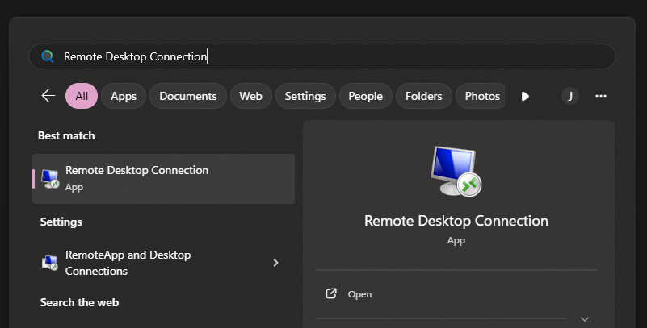
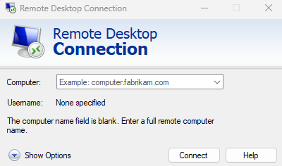
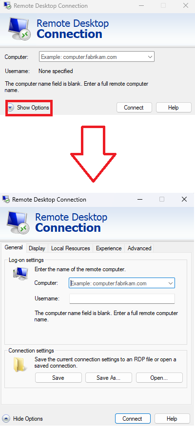
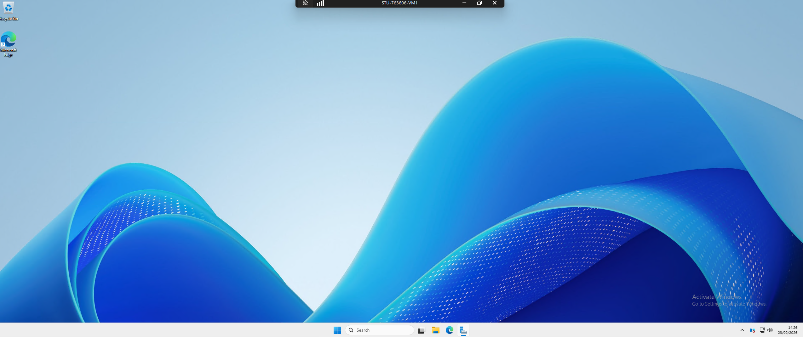
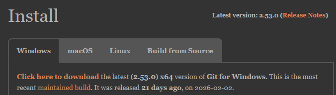
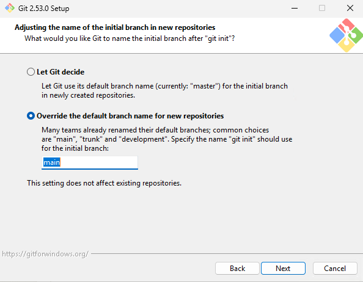
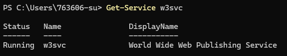
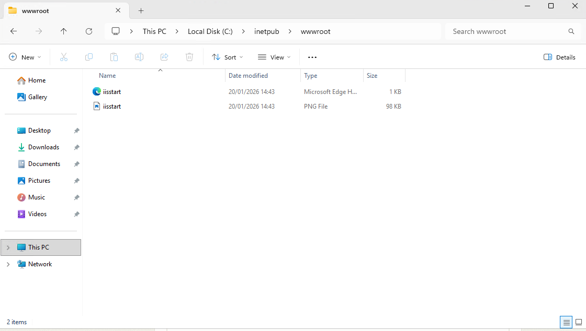
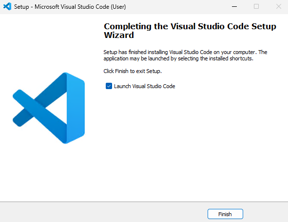
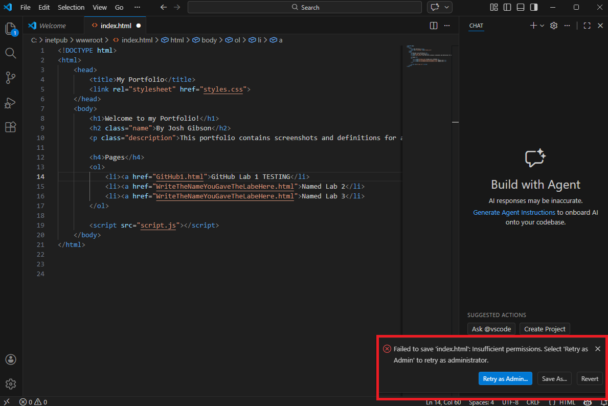

<html lang="en">
<head>
    <meta charset="UTF-8">
    <meta name="viewport" content="width=device-width, initial-scale=1.0">
    <!-- Bootstrap CSS -->
    <link href="https://stackpath.bootstrapcdn.com/bootstrap/4.5.2/css/bootstrap.min.css" rel="stylesheet">
</head>
<body>

    

    <svg xmlns="http://www.w3.org/2000/svg" width="16" height="16" fill="currentColor" class="bi bi-lightbulb" viewBox="0 0 16 16">
    <path d="M2 6a6 6 0 1 1 10.174 4.31c-.203.196-.359.4-.453.619l-.762 1.769A.5.5 0 0 1 10.5 13a.5.5 0 0 1 0 1 .5.5 0 0 1 0 1l-.224.447a1 1 0 0 1-.894.553H6.618a1 1 0 0 1-.894-.553L5.5 15a.5.5 0 0 1 0-1 .5.5 0 0 1 0-1 .5.5 0 0 1-.46-.302l-.761-1.77a2 2 0 0 0-.453-.618A5.98 5.98 0 0 1 2 6m6-5a5 5 0 0 0-3.479 8.592c.263.254.514.564.676.941L5.83 12h4.342l.632-1.467c.162-.377.413-.687.676-.941A5 5 0 0 0 8 1"/>
</svg> <strong>Note!!</strong>
A Reminder that each of these labs follow from one another, so for this one to work properly you must have completed the previous ones, please make sure that both GitHub labs one and two, and your HTML, CSS and JavaScript labs are completed before attempting this one. 
    

<!-- Bootstrap JS and dependencies -->

</body>
</html>

# Section One: Accessing and Setting Up A VM
In this week’s lab, you are going to take your Online Portfolio and host it from a Web Server that is running in a Virtual Machine.  
 
In order to do this, you first need to gain access to your Virtual Machine.  
 
To do this, we are going to use RDP (Remote Desktop Protocol) using a Microsoft application called Remote Desktop Connection.  

Open the Start Menu and search for Remote Desktop Connection - you should see a program like the one below: 

After you have opened the program, you should see this screen; this is the Remote Desktop Connection window. 

Before you do anything else, press the “show options” button. This will expand the Remote Desktop Connection window and allow you to enter your username.  

 

You now need to enter the name of the PC you wish to connect to – for you this will be “STU-6DIGITSTUDENTNUMBER-VM1" (You must replace 6DIGITSTUDENTNUMBER with your own 6-digit student number). 

You should then enter your 6-digit student number into the Username field and then press connect.  

TIP! If your username doesn’t work, you may need to add ADIR\ before it, to prompt the active directory service – so this would look like: ADIR\YOUR6DIGITNUMBERHERE. 

When you have done this, you should be prompted with a window that asks you to enter your password. This is the same Password that you use to log on to any University Machine. 
 
You may then get a notification that tells you that the identity of the remote computer cannot be verified, check the name in the certificate on the warning message, and if it is the same as the one you entered you are safe to proceed – you shouldn’t be connecting to machines you don’t trust! 

When you accept the notification, you should be sent to a Windows Desktop looking screen like the one below – this is Windows Server and is where you will be hosting your website. 

 

Checking for (and completing a) GIT Installation. 

Before you can get your Portfolio on to your Windows Server, you first need to install GIT. 

To check if you already have Git installed, in PowerShell write the command: 

git version 

If The Terminal returns information about your Git install, then you currently have access to use Git on your PC. If it returns the following error: 

Then you need to ensure that Git is installed on your machine. If you already have a valid Git install you can progress to the “Creating a repository” page. Otherwise: 

To download Git, visit the following link: https://git-scm.com/download/win 

Select the option at the top of the page to download the latest version of git and wait for the download to finish. 

 

When the download has completed run the installer and keep the preferences to their default, until you hit the “initial branch” window – in this Window you should choose to override the default branch name, and set it to “main”. 

The next window asks you to adjust your PATH environment, this should be set to the command line and third party software. 

You should also choose the option to use the bundled OpenSSH. 

 

And select to use the OpenSSL library for your HTTPS connections. 

 

Select that you wish to checkout Windows style in the next window. 

 

In the next window select that you wish to use the default windows console window. 

Keep the “Git pull” data to its default behaviour, which is fast-forward or merge. 

 

Keep the Git credential manager at its default value. 

 

Keep enable file system caching turned on. 

 

If prompted, leave any experimental features off. 

Finally, click install to start the installation process. 

Reopen the command prompt and type git, if you get a response like the one below GIT has been installed correctly 

 

Now you have GIT installed you should navigate to the documents folder on your Virtual Machine and create a new folder called “Deployment” 

<html lang="en">
<head>
    <meta charset="UTF-8">
    <meta name="viewport" content="width=device-width, initial-scale=1.0">
    <!-- Bootstrap CSS -->
    <link href="https://stackpath.bootstrapcdn.com/bootstrap/4.5.2/css/bootstrap.min.css" rel="stylesheet">
</head>
<body>

    

    <svg xmlns="http://www.w3.org/2000/svg" width="16" height="16" fill="currentColor" class="bi bi-lightbulb" viewBox="0 0 16 16">
    <path d="M2 6a6 6 0 1 1 10.174 4.31c-.203.196-.359.4-.453.619l-.762 1.769A.5.5 0 0 1 10.5 13a.5.5 0 0 1 0 1 .5.5 0 0 1 0 1l-.224.447a1 1 0 0 1-.894.553H6.618a1 1 0 0 1-.894-.553L5.5 15a.5.5 0 0 1 0-1 .5.5 0 0 1 0-1 .5.5 0 0 1-.46-.302l-.761-1.77a2 2 0 0 0-.453-.618A5.98 5.98 0 0 1 2 6m6-5a5 5 0 0 0-3.479 8.592c.263.254.514.564.676.941L5.83 12h4.342l.632-1.467c.162-.377.413-.687.676-.941A5 5 0 0 0 8 1"/>
</svg> <strong>TASK:</strong>
Using the skills gained in previous labs, clone your portfolio into the newly created “Deployment” folder. 
    

<!-- Bootstrap JS and dependencies -->

</body>
</html>

<html lang="en">
<head>
    <meta charset="UTF-8">
    <meta name="viewport" content="width=device-width, initial-scale=1.0">
    <!-- Bootstrap CSS -->
    <link href="https://stackpath.bootstrapcdn.com/bootstrap/4.5.2/css/bootstrap.min.css" rel="stylesheet">
</head>
<body>

    

    <svg xmlns="http://www.w3.org/2000/svg" width="16" height="16" fill="currentColor" class="bi bi-lightbulb" viewBox="0 0 16 16">
    <path d="M2 6a6 6 0 1 1 10.174 4.31c-.203.196-.359.4-.453.619l-.762 1.769A.5.5 0 0 1 10.5 13a.5.5 0 0 1 0 1 .5.5 0 0 1 0 1l-.224.447a1 1 0 0 1-.894.553H6.618a1 1 0 0 1-.894-.553L5.5 15a.5.5 0 0 1 0-1 .5.5 0 0 1 0-1 .5.5 0 0 1-.46-.302l-.761-1.77a2 2 0 0 0-.453-.618A5.98 5.98 0 0 1 2 6m6-5a5 5 0 0 0-3.479 8.592c.263.254.514.564.676.941L5.83 12h4.342l.632-1.467c.162-.377.413-.687.676-.941A5 5 0 0 0 8 1"/>
</svg> <strong>TASK:</strong>
Add a screenshot of your cloned portfolio repository inside of your VM – WITH the bar at the top of the screen showing your VM name showing. Then write a description of what you have just done. 
    

<!-- Bootstrap JS and dependencies -->

</body>
</html>

# Section Two: Setting Up A VM For Web Hosting

To run your website inside of the VM we are going to use IIS (Internet Information Services) which is Web Server software created by Microsoft that is native to Windows.  

IIS should be installed on these machines by default, but we’re going to make sure that it is running before attempting to host a website on it.  

There are a few different ways we can do this, but the best way with our current permission level on these VMs is to query “w3svc” which is a service called World Wide Web Publishing Service that sits on top of IIS. 

Open a terminal and enter the following command: 

Get-Service w3svc 

If everything it working correctly you should get this response back from the terminal: 
 

 
If you don’t, please let myself or the demonstrators know!  

Now, on your VM, go to the following folder: This PC -> Local Disk (C) -> inetpub -> wwwroot 
 
When you get there you should see a folder structure that looks like this: 
 
 

The two files that are here are just generic IIS files, they are not essential but are good for error testing – for now keep them safe by cutting them and pasting them on your desktop. 
 
You may be prompted to provide administrative privileges to complete this, if you are you can press okay.  

Then, you can go back to the deployment folder you created earlier and select everything from there and copy it into the wwwroot folder. This will automatically pick up your index.html file as the main file in your website, in a similar way to GitHub pages.  

Now, minimise the main VM and open the browser on your local machine. 

Enter the address http://stu-YOUR6DIGITUSERNAMEHERE-vm1.net.dcs.hull.ac.uk into the browser, and you should see your website appear!

<html lang="en">
<head>
    <meta charset="UTF-8">
    <meta name="viewport" content="width=device-width, initial-scale=1.0">
    <!-- Bootstrap CSS -->
    <link href="https://stackpath.bootstrapcdn.com/bootstrap/4.5.2/css/bootstrap.min.css" rel="stylesheet">
</head>
<body>

    

    <svg xmlns="http://www.w3.org/2000/svg" width="16" height="16" fill="currentColor" class="bi bi-lightbulb" viewBox="0 0 16 16">
    <path d="M2 6a6 6 0 1 1 10.174 4.31c-.203.196-.359.4-.453.619l-.762 1.769A.5.5 0 0 1 10.5 13a.5.5 0 0 1 0 1 .5.5 0 0 1 0 1l-.224.447a1 1 0 0 1-.894.553H6.618a1 1 0 0 1-.894-.553L5.5 15a.5.5 0 0 1 0-1 .5.5 0 0 1 0-1 .5.5 0 0 1-.46-.302l-.761-1.77a2 2 0 0 0-.453-.618A5.98 5.98 0 0 1 2 6m6-5a5 5 0 0 0-3.479 8.592c.263.254.514.564.676.941L5.83 12h4.342l.632-1.467c.162-.377.413-.687.676-.941A5 5 0 0 0 8 1"/>
</svg> <strong>TASK:</strong>
Screenshot your website working in the browser and explain what you have just done in your portfolio, your screenshot MUST show the address bar showing that you have accessed your VM.  
    

<!-- Bootstrap JS and dependencies -->

</body>
</html>
 
# Section Three: Setting Up A Development VM

<html lang="en">
<head>
    <meta charset="UTF-8">
    <meta name="viewport" content="width=device-width, initial-scale=1.0">
    <!-- Bootstrap CSS -->
    <link href="https://stackpath.bootstrapcdn.com/bootstrap/4.5.2/css/bootstrap.min.css" rel="stylesheet">
</head>
<body>

    

    <svg xmlns="http://www.w3.org/2000/svg" width="16" height="16" fill="currentColor" class="bi bi-lightbulb" viewBox="0 0 16 16">
    <path d="M2 6a6 6 0 1 1 10.174 4.31c-.203.196-.359.4-.453.619l-.762 1.769A.5.5 0 0 1 10.5 13a.5.5 0 0 1 0 1 .5.5 0 0 1 0 1l-.224.447a1 1 0 0 1-.894.553H6.618a1 1 0 0 1-.894-.553L5.5 15a.5.5 0 0 1 0-1 .5.5 0 0 1 0-1 .5.5 0 0 1-.46-.302l-.761-1.77a2 2 0 0 0-.453-.618A5.98 5.98 0 0 1 2 6m6-5a5 5 0 0 0-3.479 8.592c.263.254.514.564.676.941L5.83 12h4.342l.632-1.467c.162-.377.413-.687.676-.941A5 5 0 0 0 8 1"/>
</svg> <strong>TASK:</strong>
Repeat the same steps again, this time on “STU-6DIGITSTUDENTNUMBER-VM2" this is going to be your Development VM, so instead of creating a “Deployment” folder on the desktops of the VM you should create a “Development” one. Add screenshots to your portfolio of both your GIT portfolio repository saved into your VM and your website working from the second VM, both should clearly have the Virtual Machine name and Website URL present in the provided images.    
    

<!-- Bootstrap JS and dependencies -->

</body>
</html>

# Section Four: Editing A Development VM

Now you have your development VM working you need somewhere where you can actually develop.  
 
To do this we are going to install Visual Studio Code, you can do this by visiting this link: https://code.visualstudio.com/docs/?dv=win64user on your Virtual Machine. 
 
Once the file has downloaded, open it and accept the licence agreement, you are then free to click through the installer keeping everything at its default.  
 
When completed, ensure “Launch Visual Studio Code” is selected, and press finish.  

Once open, you can then open your website from the wwwroot folder, in the same way that you would do on your local machine.  
 
Make a small change to your website inside of your development VM, this could be some text being changed, or the background colour of the website, and save your changes.  

You may notice that the save fails, and you get a pop-up at the bottom of your Visual Studio Code window telling you that the save failed as you don’t have the correct permissions. 

This is due to the wwwroot folder you are saving in being a protected folder – this means that you can only make changes to it if you are an administrator. 

Select the retry as admin button shown below: 
 

This may cause a pop-up to appear on the screen, you can accept this. And your changes should save correctly. 
 
<html lang="en">
<head>
    <meta charset="UTF-8">
    <meta name="viewport" content="width=device-width, initial-scale=1.0">
    <!-- Bootstrap CSS -->
    <link href="https://stackpath.bootstrapcdn.com/bootstrap/4.5.2/css/bootstrap.min.css" rel="stylesheet">
</head>
<body>

    

    <svg xmlns="http://www.w3.org/2000/svg" width="16" height="16" fill="currentColor" class="bi bi-lightbulb" viewBox="0 0 16 16">
    <path d="M2 6a6 6 0 1 1 10.174 4.31c-.203.196-.359.4-.453.619l-.762 1.769A.5.5 0 0 1 10.5 13a.5.5 0 0 1 0 1 .5.5 0 0 1 0 1l-.224.447a1 1 0 0 1-.894.553H6.618a1 1 0 0 1-.894-.553L5.5 15a.5.5 0 0 1 0-1 .5.5 0 0 1 0-1 .5.5 0 0 1-.46-.302l-.761-1.77a2 2 0 0 0-.453-.618A5.98 5.98 0 0 1 2 6m6-5a5 5 0 0 0-3.479 8.592c.263.254.514.564.676.941L5.83 12h4.342l.632-1.467c.162-.377.413-.687.676-.941A5 5 0 0 0 8 1"/>
</svg> <strong>TASK:</strong>
Open your original website on the http://stu-YOUR6DIGITUSERNAMEHERE-vm1.net.dcs.hull.ac.uk link, and your new version on http://stu-YOUR6DIGITUSERNAMEHERE-vm2.net.dcs.hull.ac.uk 
 
Screenshot both websites together, and add an explanation of what you changed between the deployed version and the development version.     
    

<!-- Bootstrap JS and dependencies -->

</body>
</html>

